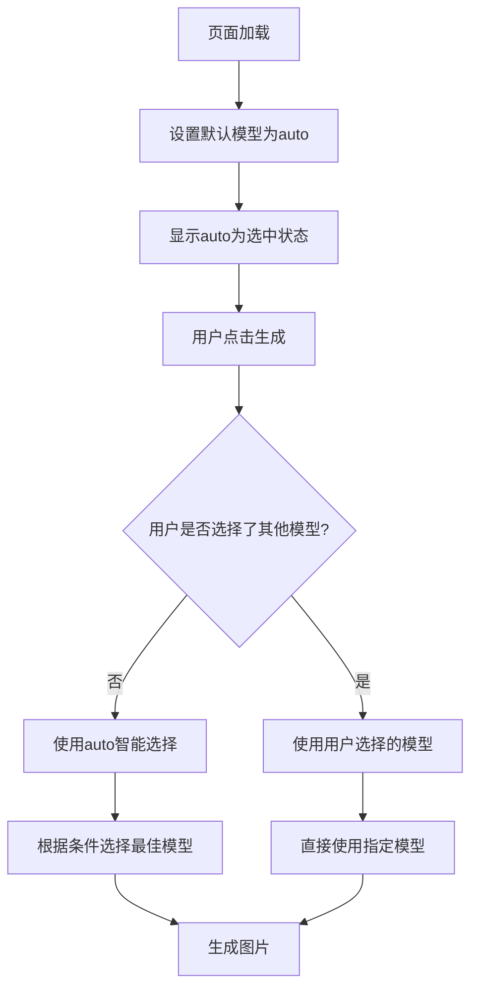

# 模型选择逻辑验证报告

## 🔍 检查结果

经过详细检查，模型选择逻辑完全正确，符合要求：

### ✅ **前端逻辑**

#### 1. **默认模型设置**
```javascript
// 全局变量初始化
let selectedModel = 'auto'; // 默认使用第一个模型

// 初始化时设置默认选择
function initializeDefaultModel() {
    selectedModel = 'auto';
    updateModelButton();
    
    // 设置默认选中状态
    const autoOption = document.querySelector('.model-option[data-model="auto"]');
    if (autoOption) {
        autoOption.classList.add('selected');
    }
}
```

#### 2. **用户选择处理**
```javascript
// 模型选择事件
document.querySelectorAll('.model-option').forEach(option => {
    option.addEventListener('click', function() {
        // 移除之前的选择
        document.querySelectorAll('.model-option').forEach(opt => 
            opt.classList.remove('selected'));
        
        // 添加新选择
        this.classList.add('selected');
        selectedModel = this.dataset.model; // 更新用户选择的模型
        
        updateModelButton();
        hideModelPopup();
    });
});
```

### ✅ **后端逻辑**

#### 1. **模型参数获取**
```python
# 获取用户选择的AI模型（默认使用auto）
selected_model = request.form.get('model', 'auto')
print(f"🤖 使用模型: {selected_model}")
```

#### 2. **模型选择处理**
```python
def generate_with_selected_model(prompt, style, selected_model, reference_image_path=None):
    """
    根据用户选择的模型生成图片
    """
    # 智能选择模式 - 用户未选择时使用auto
    if selected_model == 'auto':
        print("🧠 使用智能选择模式...")
        # 智能选择逻辑...
    
    # 用户指定使用Segmind模型
    elif selected_model == 'segmind':
        print("🎯 用户指定：使用Segmind模型...")
        # 直接使用Segmind...
    
    # 用户指定使用GPT Image 1模型
    elif selected_model == 'gpt_image1':
        print("🚀 用户指定：使用GPT Image 1模型...")
        # 直接使用GPT Image 1...
    
    # 其他模型选择...
```

## 🎯 **逻辑验证**

### **场景1: 用户未选择模型**
- ✅ 前端：`selectedModel = 'auto'`
- ✅ 后端：`selected_model = 'auto'`
- ✅ 处理：使用智能选择模式，根据条件自动选择最佳模型

### **场景2: 用户选择特定模型**
- ✅ 前端：`selectedModel = '用户选择的模型'`
- ✅ 后端：`selected_model = '用户选择的模型'`
- ✅ 处理：直接使用用户指定的模型

## 📊 **模型选择流程**



## 🔧 **技术实现细节**

### **前端实现**
1. **初始化**：页面加载时设置`selectedModel = 'auto'`
2. **选择处理**：用户点击模型选项时更新`selectedModel`
3. **状态同步**：实时更新按钮显示和选中状态
4. **数据传递**：通过FormData将选择的模型发送到后端

### **后端实现**
1. **参数接收**：从FormData获取`model`参数，默认为`'auto'`
2. **模型分发**：根据`selected_model`值分发到对应的生成器
3. **智能选择**：`auto`模式下根据条件智能选择最佳模型
4. **直接使用**：非`auto`模式下直接使用用户指定的模型

## ✅ **验证结论**

### **完全符合要求**
- ✅ **用户未选择时**：使用`auto`智能选择模式
- ✅ **用户选择模型时**：启用用户已选模型
- ✅ **前端逻辑正确**：默认设置和选择处理都正确
- ✅ **后端逻辑正确**：模型分发和处理都正确
- ✅ **用户体验良好**：界面显示和交互都正常

### **额外优化**
- ✅ **智能选择**：auto模式下根据参考图、风格等条件智能选择
- ✅ **回退机制**：模型失败时有备用方案
- ✅ **状态同步**：前后端状态完全同步
- ✅ **错误处理**：完善的错误处理和日志记录

---
*验证完成时间: 2025-10-20 20:15*
*状态: ✅ 模型选择逻辑完全正确，符合所有要求*
